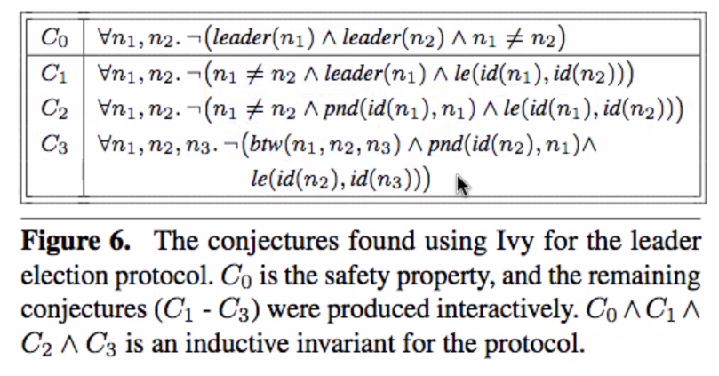

These are paraphrased notes from a live discussion with several people.
Parenthesis or brackets are used where the paraphrasing is particularly distant
from what the speaker said. Feel free to edit these notes as you see fit.

# 2020-08-28, paper discussion

## Week 1 of 1 for [Composing and Decomposing Op-Based CRDTs with Semidirect Products](https://dl.acm.org/doi/pdf/10.1145/3408976)

* lindsey: as gan pointed out, it's nice that this paper is open access;
  they're published in PACMPL; all of the big four ACM conferences are in
  PACMPL except for PLDI
    * lindsey: the upshot is that it's really easy to get modern PL papers
      because they're open access by default
* lindsey: some context: Heather Miller and Christopher Meiklejohn are
  longtime friends of mine! [background on heather and chris]
    * lindsey: chris worked at Basho on Riak they were on the cutting edge of
      putting CRDTs in a product
    * lindsey: this is not a systems paper; it's not about evaluation &
      implementation
* lindsey: big picture
    * lindsey: CRDTs known by that name have been around since around 2011
    * lindsey: composability has always been discussed (elementwise
      composition: a Map with elements that are CDTS or a Set with elements
      that are CRDTS)
    * lindsey: this paper makes the point that some compositions don't work
      naturally (adding an (f)map operation to a Map to change the values; such
      an operation would confict with the Map's add operation [if you don't add
      and (f)map in the same order, you'll get a different final resulting Map)
    * lindsey: so this paper is more about composing operations on the same
      CRDT (as opposed to composing data structures)
* lindsey: the idea is..
    * lindsey: you decide on the semantics you want first; eg. always do Map
      add before Map (f)map; and then if you get operations out of order, you
      can adjust the later operations to apply correctly (similar to OT)
    * lindsey: there are lots of fiddly details that are difficult to get right
        * lindsey: in section 4 they add (f)map to a Map that has add, but they
          say that delete is now too hard and leave it for future work
        * lindsey: Question: is deletion special?
    * lindsey: the difficult part is designing the partial-action so that even
      [when things are out of order, things work out]
        * lindsey: in section 4 they discuss the specific example and in
          section 6 "generality" they [might be generalizing]
    * lindsey: in 6.1 they introduce OT; the classic example is "insert at
      index 3 to list" and concurrently "insert at index 1 to list" where the
      order of these requires that the index is adjusted
        * patrick: RGA gets around this by using a "globally unique" index?
        * lindsey: but in OT, you do an operation on the index; OT is less
          explored in the research
        * lindsey: this paper is interesting they're [formalizing what OT is]
* lindsey: what do you all think of this paper?
    * gan: i read some additional papers
    * farhad: this seems more like a way to do things than an automatically
      generating
        * lindsey: yeah, there's nothing in here about automatic generation or
          decomposition or verification of CRDTs
        * lindsey: they show that two specifyc CRDTs crossed are a CRDT; they
          show that their semidirect product is an implementation of a
          reference from 1996; they claim something else about a CRDT called
          POlog
        * lindsey: this is a paper that presents a new idea; they don't know if
          it's fully general; they generated some novel CRDTs; the semidirect
          product can also be used to decompose CRDTs and that this is what
          people are already doing

# 2020-08-14, paper discussion

## Week 2 of 2 for [Safe Replication through Bounded Concurrency Verification by Kaki et al. (OOPSLA '18)](https://www.cs.purdue.edu/homes/suresh/papers/oopsla18.pdf) (aka Q9)

* lindsey: the insight of the Q9 paper is to use symbolic evaluation to
  exaustively explore a smaller number of states than "all possible states at
  all replicas"
    * lindsey: they say at the beginning they'll do bounded verification;
      bounded by what? "a finite concurrency bound" but what does that mean?
    * lindsey: it's defined in 5.3, where they define concurrent effects: "a
      concurrent effect is an effectt that is not present on at least one
      replica"; with the assumption that "most of the effects are on all of the
      replicas"; we're only going to reason about the effects which aren't on
      all replicas
    * lindsey: how? they pick some number k, do symbolic execution, to reason
      "at once" about all of the things that can happen within that bound
* lindsey: returning to the beginning; what was difficult to understand?
    * patrick: 5.1 and 5.3, mostly 5.3
    * farhad: same
    * lindsey: aside; in intro "full verification is challenging in part
      because of the need to specify suitably strong invariants" [citation to
      ivy paper (inspiration for mypyv)]
        * note the term "inductive invariant"
            * if you want to prove something about a program, eg. "bank acct
              =0" (call it S)
            * the invariant you want to prove (S) may not (probably not) an
              inductive invariant (I)
            * you want an inductive invariant (I), because that can be proved
              by induction
            * you do that by using the "if it holds in the initial state" and
              "it holds in some state s -> it holds one step later" stuff
            * so you need to come up with an inductive invariant (I), which
              implies the *real safety property* (S) that you care about
            * ivy provides automation to find the (I) corresponding to (S),
              using user assistance
            * eg. inductive invariants are more complex
                * 
                * C0 is (S) "not two leaders"
                * the rest of the things are required to make it inductive (I)
        * distinction, the Q9 paper doesn't search for inductive invariants, it
          instead does bounded verification
    * lindsey/farhad/patrick: let's look at section 5.3
        * lindsey: note, that this paper has some obvious mistakes (eg.
          unfinished sentence, misspelled word in fig 6)
        * lindsey: let's look at the symbolic evaluation rules, starting with
          S-Match-BoolSym
        * lindsey: what is symbolic execution? what is concrete execution?
            * concrete: have a program, take input, get output
            * symbolic: you run the program on a symbolic input (a range of
              inputs), and you get a symbolic value as output`
        * lindsey: they distinguish between destructable and non-destructable
          values
            * destructable means you can proceed with execution; eg. constants
              and applications of constructors to constants, which you can
              pattern-match against
            * non destructable values lead to evaluation of both sides of
              branches
    * lindsey:
        * in sec 3 they talk about the language people write, ocaml
        * they compile that to an IR
            * patrick: isn't the IR the thing from 5.1?
                * lindsey: not exactly
        * they run the symbolic execution on the IR
        * lindsey: this is a common technique, see [klee
          paper](https://www.doc.ic.ac.uk/~cristic/papers/klee-osdi-08.pdf)
    * lindsey: sec 5.3 rules continue
        * after defining $DOWN_ARROW they have enough to define $RIGHT_ARROW
          (the small step symbolic-execution), the rule S-Oper
    * lindsey: section on automated repair; very similar to the Quelea paper
        * they don't really say what it does

# 2020-08-07, paper discussion

## Week 1 of 2 for [Safe Replication through Bounded Concurrency Verification by Kaki et al. (OOPSLA '18)](https://www.cs.purdue.edu/homes/suresh/papers/oopsla18.pdf) (aka Q9)

* lindsey: tough paper, section 5 is particularly dense
    * consider putting off if people haven't read at depth
        * [all agree]

[group meeting]

* lindsey: bounded concurrency; if you bound the number of concurrent
  operations, is the application safe?
    * the boundedness is what makes it possible to use an SMT solver to explore
      the search space of all concurrent program interleavings
* lindsey: q9 can discover the consistency level [which is required for a thing
  to be safe]
    * aside on the consistency level meta language
        * first paper that presented the specification language for talking
          about the consistency [of a store; of an operation on a store] was
          [Replicated Data Types: Specification, Verification,
          Optimality](https://www.microsoft.com/en-us/research/wp-content/uploads/2016/02/replDataTypesPOPL13-complete.pdf)
          aka "RDTs: SVO"
            * > When I talk about "The Burckhardt specification language" I
              mean the thing from these books which lots of people now use.
              Quelea uses it, Q9 uses it, I think CISE uses it, Viotti and
              Vukolic use it in https://arxiv.org/abs/1512.00168, , etc.
            * see also Sohum's blog post about some of the key ideas, [Time is
              Partial, or: why do distributed consistency models and weak
              memory models look so similar,
              anyway?](http://composition.al/CMPS290S-2018-09/2018/11/17/time-is-partial-or-why-do-distributed-consistency-models-and-weak-memory-models-look-so-similar-anyway.html)
        * author then went on to write [Principals of Eventual
          Consistency](https://www.microsoft.com/en-us/research/wp-content/uploads/2016/02/final-printversion-10-5-14.pdf)
          book; it's not just about eventual consistency though; it should be
          s/eventual/distributed/g
* lindsey: why is this [q9] cool?
    * it can discover anomalies when a consistency level is too week
    * it can also discover when a consistency level is too strong
    * suggests a development methodology where you start with strong
      consistency, and then progressively weaken things
    * q9 is implemented as an ocaml compiler pass, and it takes an ocaml
      program as input; uses sentinel identifier names, eg. a predicate named
      "inv_*" will be checked
* lindsey: section 5 is dense, but all of the details is necessary
* lindsey: they're aiming for a fully automated verification approach, but the
  tradeoff is the fact that they have a limit on the number of concurrent
  operations
    * patrick: why do some things need to be "bounded" and some not? eg. LH can
      prove for all cases (bounded by time)
    * patrick/lindsey: they hypothesized that the k for concurrent operations
      would be small, so they built it to be bound by that

# 2020-07-31, paper discussion

## Week 1 of 1 for [Stronger Semantics for Low-Latency Geo-Replicated Storage by Lloyd et al. (NSDI '13)](https://www.usenix.org/system/files/conference/nsdi13/nsdi13-final149.pdf) (aka COPS2)

* lindsey: should we discuss cops2 or indigo stuff more?
    * gan: tbh i didn't get much for cops2; it feels very similar to cops
    * lindsey: yeah, this is a followup to cops, and this one got cited by
      chapar; i got something out of it: patrick remarked it's easier to
      understand, and i agree; what are the differences? eiger supports a more
      complex data model
        * lindsey: it's cool because they are demonstrating that their approach
          to enforcing causal consistency also works in this scenario
        * lindsey: if there's one high-level point, it's that you get pretty
          far with just causal consistency, and only certain things need strong
          consistency
        * lindsey: i would argue that the consistency model should be a
          property of the request
        * lindsey: the paper shows that you can have causal consistency at
          scale, and so we should focus on the space between causal consistency
          and strong consistency
        * lindsey: for 2005-2012 or so, people felt that you need weaker
          consistency models; since then it's become clearer that reasonably
          strong consistency is possible
        * lindsey: there's a paper [cause i'm strong
          enough](https://pages.lip6.fr/Marc.Shapiro/papers/CISE-POPL-2016.pdf);
          at the time i thought it was weird because causal-consistency seemed
          strong, but chapar/cops2/cise all make the case that
          causal-conistency is a baseline
        * patrick: so if causal-consistency is the sweet spot, and we're
          looking north of that, would a valuable contribution be to find a new
          sweet spot between causal-consistency and strong consistency?
            * lindsey: yes, but some of that is going to be up to the needs of
              applications
        * patrick: is it valuable to think about different implementations and
          understanding their tradeoffs?
            * lindsey: yes
                * lamport: dependencies between send and receive events
                * cbcast: dependencies between clock-values on messages
                * cops: dependencies between versions of values
                * cops2: dependencies between operations
        * lindsey: the application specific constraints on top of
          causal-consistency, such as `bank-balance>=0` or
          `0<tournament-participants &&
          tournament-participants<=max-participants`
            * patrick: these constraints make the consistency model stronger
              than causal-consistency, but should we care about them?
            * lindsey: yes, but they don't define a new consistency model
            * farhad: most of the applications we've looked at is that most of
              the applications assume causal-consistency
            * lindsey: the cav19 paper with crdts shows that we don't always
              need this baseline though
            * lindsey: in the UMD/OOPSLA paper they made that argument, and
              said it's ok because of the proof of commutativity, but the ad
              hoc nature of the guarantees may be application specific
        * lindsey: i got into crdt research because the math is interesting,
          but maybe we should be into it to empower people
          <https://twitter.com/martinkl/status/1288836873482379266>

# 2020-07-24, paper discussion

## Week 1 of 1 for [Don't Settle for Eventual: Scalable Causal Consistency for Wide-Area Storage with COPS by Lloyd et al. (SOSP '11)](https://www.cs.cmu.edu/~dga/papers/cops-sosp2011.pdf)

* lindsey: what did you think of it? picking on patrick
    * patrick: it was vague, and didn't formalize sufficiently; i like the
      attention to real network constraints, such as clusters that communicate
      and wider area networks that don't, and the fact that they don't rely on
      broadcast
    * lindsey: last year's spec for the DKVS project essentially specified the
      exact COPS-GT way of tracking causal ordering
    * lindsey: how are they claiming scalability?
    * patrick: i think they're comparing apples and oranges; CBCAST is a
      message ordering protocol, not a k/v store and doesn't require a
      full-replica
    * lindsey: maybe they were referring to ISIS (the system that CBCAST is
      used to implement) which is used in the french air traffic control system
    * gan: and in the chapar paper, they pointed out that CBCAST using vector
      clocks, was an overapproximation, and was more ordered, than it needed to
      be; and then in the cops paper, the data showed that the CBCAST
      implementation [wasn't as good as] the [other systems?]
* lindsey: they also say that other systems that provide this consistency
  level, were designed such that there was a single "serialization point"
    * in sec 3.4, they discuss alternative systems and say that a "logical
      replica" has a single serialization point
    * "a single serialization point" for a "logical replica" (in list case, a
      COPS) is a scaling bottleneck
    * "the composability of linearizability ensures that the resulting system
      is lineearizable as a whole"
* lindsey: it's a very challenging task to try to describe a system in a way
  that brings the important ideas to the forefront, while still being precise
  about what the system does
* lindsey: let's talk about the "plus" part of "causal+"
    * lindsey: even if you have causal consistency, you could have replicas
      that diverge forever
    * gan: a partial order is not a total order
    * lindsey: they want an extra piece, but the way the implement it with LWW,
      using the node-id in the lamport clock
    * patrick: it's consistent!
    * lindsey: they don't enforce the conflict resolution function being
      associative and commutative
    * lindsey: next week's paper is a followup to COPS, called Eiger, but it
      doesn't have any more sophistication in conflict resolution
* lindsey: one of the reasons i wanted to read this paper is because they built
  this system, deployed it on several servers, and spent 25% of the paper to
  evaluate the system
    * patrick: can we do both in one system?
    * lindsey: we should hope! and OOPSLA and PLDI are those kinds of
      conferences, and in the chapar paper they did run their system
* lindsey: intermediate languages for verification is not a new idea; "boogie"
  is an intermediate language which you can target from any Microsoft CLR
  language [gan: eg. daphne]

# 2020-07-17, paper discussion

## Week 1 of 1 for [Chapar: Certified Causally Consistent Distributed Key-Value Stores by Lesani, Bell, and Chlipala (POPL '16)](https://www.cs.ucr.edu/~lesani/companion/popl16/POPL16.pdf)

* lindsey: coming back to this paper after not reading it for a long time, and
  knowing now that i care about different things than i did in the past, i have
  some thoughts
* lindsey: let's talk about the introduction
    * the nice emoji-laden diagrams demonstrate with crossed arrows not only a
      violation of causal consistency, but also FIFO or P-RAM consistency
      (pipelined ram)
    * this is a nice way to talk about it, but instead of talking about events,
      here we're talking about key-value stores
    * the arrows in the diagram could be thought of not as message sends, but
      rather as representing when updates from a replica get applied at another
      replica
    * the crossed arrows are an easy tell that this is a violation of those
      consistency schemes
* lindsey: they define two kinds of depenedncies which are similar to the
  classic cases described in causal consistency
    * "node-order" or "process-order" or "session-order" or "execution thread"
      dependency
    * "causal" or "gets-from" dependency
    * "transitive" dependency
* lindsey: how do they put the pieces (from figure 3) together?
    * lindsey: *concrete operational semantics* (COS) -- fig 6; something you
      plug a particular k/v implementation in; provides no guarantees; message
      order is arbitrary, messages might not be delivered
        * lindsey: describes transitions on a "world" which includes all the
          state (H, T) written as "H x T"
        * lindsey: describes state transitions from old (H, T) -> new (H, T)
            * H is (node-id -> program-statement, map)
            * etc..
        * the thing to notice is that the COS doesn't rule out anything
        * patrick: so this is defining all possible behaviors in the domain we
          care about, without defining anything about what's correct
        * lindsey: you could even think of it as modeling the network layer,
          because it puts no restrictions on the behavior; all kinds of badness
          could occur
    * lindsey: *abstract operational semantics* (AOS) -- fig 7, they don't have
      any notition of messages; it's almost like shared memory
        * gan: it's kind of like updates [patrick: i think gan is referring to
          cav19]
        * lindsey: it's sort of like the transition system of the cav19 paper
        * lindsey: re, patrick's question about this: this just means that the
          COS had a notion of messages, the set of in-transit messages, but the
          AOS doesn't; it just describes how a clock get updated when a put
          happens
            * patrick: so the AOS is only modeling what is correct, and so it
              doesn't need to model incorrect behaviors
        * lindsey: notice the COS is modeling "executions with node crashes and
          message losses" in in contrast; also this is notable, because many
          papers don't model those things
            * patrick: what's the language this is all written in
            * lindsey: metatheory, they don't make it explicit
            * lindsey: notice the labels above the transition rules (---->_c),
              those generate a trace which is stored (like logging info) and
              can be reflected on later to check for assertion fails
            * lindsey: the trace is something that they write down theorems
              about; as an example, theorem 1 describes how program 1 and
              implementation 1 execute with the COS (---->_c) and won't
              encounter an assertFail [but this is specific to program 1 and
              implementation 1]
            * gan: this raises the question about whether program 1 (or any
              program) has assertions in the right place
            * lindsey: patrick asked about a program that contains only
              "assertFail.."
            * lindsey: those programs wouldn't fit the *causally content*
              definition, and [the other proof stuff wouldn't apply
              (paraphrased)]
        * lindsey: a section of this paper that i missed when i read it before,
          is that [there is checking of client programs]
        * lindsey a lot of this paper is trusting that the AOS is correct
            * gan: yes, i wanted to ask that
            * patrick: is there a proof of that outside of the paper?
            * lindsey: they don't; figure 7 (AOS) is the spec.. and the paper
              proves that implementations satisfy the spec; all verification
              has the problem of whether the spec is correct
            * gan: this paper is is like running two sorting algorithms and
              seeing if their output is the same (proving correspondence)
            * gan: another analogy is to check if outputs are sorted (proving
              directly)
            * [typist couldn't keep up]
            * lindsey: they wrote down the AOS; is it correct?
            * patrick: oh, so at popl there was a presentation of a verified C
              compiler, and the approach was to start with a spec and prove
              correspondence
            * gan: yeah, you have to start from somewhere
            * patrick: can you prove the AOS from some simpler axioms or
              something?
            * gan,lindsey: you have the same problem, in a smaller base, at
              some point you need proof
            * gan: everybody reading the poper is the proof that it's a valid
              definition
        * lindsey: [typist couldn't keep up] proving output labels here
          correspond to output labels of AOS, but that's too hard so they
          define wellrec with a new semantics, which requires its own semantics
            * then wellrec is defined with cases, and the most important case
              is discussing node-order dependency and gets-from dependency
    * lindsey: the thing that bothers people about PL papers, is that it takes
      so much to say so little; there's so much syntax to write down this
      relatively simple idea
        * farhad: many papers redefine and paraphrase other formalizations, and
          then when going in more depth they need even more notation
        * linsdey: yeah, guy steel even has a talk about how there are several
          competing standards of notation about substitution (value for
          variable in PL)
        * patrick: could casl push the long proofs from the UMD paper into the
          SMT solver or theories?
        * lindsey: you could perhaps start with a LH library of things that are
          useful to prove things about message queues, etc..
        * lindsey: SMT theories tend to not get plugged together in practice,
          instead, people implement the theories together, for a given problem
            * the combined theories are difficult to write and less efficient
            * when i looked at theories in SMT, they're not very modular
            * my hope is that as PL people is that we can figure out how to write
              these things in a modular way
            * we should bite off small manageable pieces of the problem
    * lindsey: who is this for? who is going to read fig 11 and understand it?
      a very small number of people, possibly us, because we want to go
      implement well-rec in haskell
        * gan: i would like to prove myself first, and then reference this when
          i get in trouble
        * patrick: i would like to understand LH and the UMD/OOPSLA paper first
          and then that's my route to here
    * [typist couldn't keep up]
    * farhad: can we get a little intuition for well-reception?
        * lindsey: it starts with bindings and setting up the conjunction of
          the conditions
        * farhad: i'd like to a get a gist of it, because this is the main
          thing that i couldn't understand; why is it a stand-in for proving
          causal consistency?
        * gan: it factors out common component
        * gan: if i were to start implementing this paper, i would start with
          definition 2 (showing that executions correspond) rather than
          starting with well-rec
    * lindsey: one last piece, section 6
        * lindsey: you might ask "if they were going to do this well-rec thing
          the whole time, what was the point of the AOS?"
        * lindsey: it's a symbolic execution engine for seeing whether a
          client problam asserts failure
        * lindsey: "they can use this AOS to automatically explore all
          executions of the client program to see" [whether it's correct]
        * lindsey: [showing sec3] they call the AOS an interface, distinct from
          figure 4, to say that, the AOS can be used two ways
            * as a thing to check client programs
            * and the other way, as a think to define what it means for a k/v
              store implementation to be causally consistent
        * lindsey: this section 6 discusses this idea of symbolic execution
          (lindsey's term here); they have a thing that generates all possible
          "schedules" up to a maximum number of steps M; bounded model checking
    * lindsey: and they they actually have experimental results
        * lindsey they're trying to show that the extracted code is actually
          viable
            * impl 1 is their version of Casual Memory
              <https://smartech.gatech.edu/bitstream/handle/1853/6781/GIT-CC-93-55.pdf>
            * impl 2 is their version of this:
              <http://www.istc-cc.cmu.edu/publications/papers/2013/eiger-nsdi13.pdf>
        * lindsey notice that algorithm 1 performs worse
            * they explain overapproximation of dependencies
            * serialization issues with the vector clock

* discussion of systems/implementation things [how did we get on this topic?]
    * patrick: at twitch we had a thing that had 10000 RPS for gets and
      only 100 RPS for puts
    * farhad: performance is probably application dependent, a distributed
      diary application (patrick: twitter?) would have many more puts than
      gets
    * lindsey:
        * primary/backupchained replication
            * splitting reads and writes up
        * chained replication
          <https://www.cs.cornell.edu/home/rvr/papers/OSDI04.pdf>
            * splitting reads and writes up by responding attention to the mix
              of gets and puts
        * see also <http://usenix.org/event/usenix09/tech/full_papers/terrace/terrace.pdf>

# 2020-07-10, paper discussion

## Week 1 of 1 for [Automated Parameterized Verification of CRDTs (Extended Version)](https://www.cs.purdue.edu/homes/suresh/papers/cav19.pdf) "cav19"

* lindsey: what was your takeaway for what this paper was about?
    * patrick: [vague answer]
    * kamala: proving that CRDTs converge, and proving under different
      consistency guarantees, and proving the conditions under which they
      converge.. the easy way to make them converge would be to make all
      operations commutative, [typist couldn't keep up]
    * lindsey: last time we discussed the gomes paper, and they fixed on causal
      consistency that and required that concurrent operations commute
    * lindsey: this paper is so much more general, and they have a rigorous
      definition of of exactly what consistency policy is necessary for a CRDT
      to converge, and even showed that causal consistency isn't sufficient for
      some CRDTs
    * farhad: [typist couldn't keep up]
* lindsey: [sharing table of "consistency schemes" near Definition 1]
    * lindsey: [aside] cav has a short page limit, so things are jammed in
      sometimes without labels, like "table 1" with a caption
    * lindsey: [going over parts of the table]
        * the right column header is a "configuration" which defines
          constraints on [ordering of events, visibility, other things]
    * gan: this table shows what i mean when i say that EC is no
      consistency in their definition
    * kamala: [w.r.t. causal consistency] for concurrent operations, there's
      going to be some effector order; does that mean that [the definition in
      the table] also places a constraint on the visibility order?
        * lindsey: [typist couldn't keep up]
    * gan: a consistency scheme is a [typist couldn't keep up]
        * delta [typist couldn't keep up]
        * vis - binary relation on events [typist couldn't keep up]
        * eo - binary relation on events which describes the order
    * lindsey,kamala,gan: [discussion of RedBlue consistency]
    * patrick: reminded me of the observation in the paper that there's a continuum
      between putting complexity into the environment (consistency scheme) and
      having simpler crdts, or putting complexity into the CRDTs and allowing the
      environment to be less constrained
        * lindsey: yeah, the tradeoff is between complexity of the data
          structure, the space the data structure must take up, etc.. and in
          complexity, you get that it works under the weaker consistency models
* lindsey: a question i had was .. what is the relationship between PSI
  Parallel Snapshot Isolation and SC Sequential Consistency.. [typist couldn't
  keep up]
    * sohum: it seems like PSI is a generalization of RB, where there are more
      than just two consistent sets [typist couldn't keep up]
    * lindsey: redblue just means there are two consistency models
    * lindsey: in their PSI+RB where red means PSI and blue means EC
        * "psi for some operations, and ec for the rest of them"
        * if somebody specifies redblue consistency, that tells you nothing,
          until they specify what consistency models are being combined, and
          which operations are which
* gan: going back to the question of "what this paper is about" ... this paper
  is about the parameterized verifications of crdts ... and the second part is
  about making the previous part automated
    * gan: section 3 is about the parameterization; they did this by defining
      consistency schemes as logic formulas
    * gan: the next section is about how they automated things
    * gan: i spent my time in section 3, to understand the parameterization of
      consistency schemes for CRDTs
    * lindsey: this is the first technique for verifying CRDTs which is both
      automated and parametric on consistency policies
    * lindsey: and a valuable result is that causal consistency is neither
      necessary nor sufficient for all of these CRDTs to converge
    * lindsey: then the automation is cool, because they came up with this
      condition, which they call NIC, which even though it takes a lot of
      painstaking work to prove that NIC implies SEC, nevertheless, NIC is
      machine checkable
    * lindsey: i think that this is very nice, and this paper has not been
      widely read or understood yet, perhaps because it was published in a
      different community
* patrick: what is cav?
    * lindsey: computer aided verification, they use a lot of solvers,
      sometimes they verify hardware
    * lindsey: there's a lot of PL overlap because in the last 10 years there's
      been an increase in the use of solvers in PL
    * lindsey: because they sent the paper to CAV and not to a PL conference,
      they wrote it in this way
* sohum: can we discuss noninterference of commutativity (NIC)?
    [displaying Definition 7]
    * lindsey: i find this ugly, because we have to talk specifically about
      executions that have 2 events and that have 3 events
    * lindsey: this first part has to do with executions with 2 events
    * lindsey: this next one they stick a third event in the beginning, and if
      i understand correctly, they are trying to, because they want to talk
      about executions of arbitrary length, [typist couldn't keep up; they want
      to make an indictive proof]
    * patrick: what's weird here?
        * lindsey: the third event at the beginning ...
        * sohum: maybe this is easier to machine-check than the standard
          induction formulation?
        * lindsey: [that could be it]
    * patrick: can it be summarized as "events are commutative"?
    * kamala: is it like "it doesn't matter what your starting state is?"
        * lindsey: it does matter
* lindsey: [glance at the structure of the proof; typist didn't take notes
  here]
    * lindsey: i think the hard thing to understand is how their model, this
      transition system, relates to distributed systems
* kamala: they mention somewhere that they talk about the start state and [two
  operations that must commute]
    * lindsey: there's something, in section 3
    * paper: "we restrict the start state of all events in a well-formed
      execution to be the initial CRDT state sigma_init"
    * lindsey: the key for me to understand this is that every event is an
      entire history, and the events can all be thought of starting in the
      initial state of the CRDT, and there isn't a separate notion of state
      anywhere
    * gan: this relates to their alternative definition of effectors/operations
      given at the beginning of section 3
* lindsey: [discussion of effector definitions in section 2 and section 3]
* lindsey: they don't link up their discussion with what clients can and cannot
  observe, that lookup operation on simple-set is not the same signature of the
  effectors and isn't discussed..
* [discussion of the language used for implementing CRDTs]
    * gan: <https://github.com/Kartiknagar/CAV19-Encodings>
    * gan: i think it's a standard language
* patrick: is the table with consistency schemes a standard notation called
  EPR?
    * lindsey: no, look at the repo for EPR
    * lindsey: it's pretty normal that papers will use a summary notation which
      is mostly conventional across papers in figures and text
    * see also [run your
      research](https://users.cs.northwestern.edu/~robby/lightweight-metatheory/popl2012-kcdeffmrtf.pdf),
      [POPL2012 talk about run your
      research](https://youtube.com/watch?v=BuCRToctmw0)
* lindsey: [summary] first technique for proving SEC for CRDTS that is
  parametric on consistency policies and it's an implementation of those
  policies, and it's a rigorous understanding of this relationship between
  commutativity ... [typist couldn't keep up]
* errata:
    * in the main rule of their operational semantics (top of page 7), there are two typos:
        * the premise `eo \subseteq eo_r` should read `eo|_{\Delta_r} \subseteq eo_r`. 
          in other words, the order `eo` should be restricted to the domain `\Delta_r`.
        * the premise `\eta = (..., eo)` should read `\eta = (..., eo_r)` (just the `_r` subscript is missing)
    * in the proof of Lemma 1 in the appendix, whach out for a variable renaming problem.
      they reuse the variable name `k` to mean two different things. first, they use it 
      as part of an inductive proof to say "assume it's true for `k-1`, and now let's show it for `k`".
      but then later in the proof they say "Now, for all `1 <= k < j`..." and from then on `k` means 
      something different.

# 2020-07-03, paper discussion

## Week 2 of 2 for [Verifying Strong Eventual Consistency in Distributed Systems](https://dl.acm.org/doi/10.1145/3133933) by Gomes et al. (OOPSLA '17)

* lindsey: since we have fewer people, we don't need breakout groups this time
* lindsey: let's start with the sections we didn't get to last time, such as
  section 5
    * lindsey: for structure, here are the questions again:
        2. What's one thing I learned?
        3. What's one question I'm curious about?
        4. What's one step I can take towards answering the question? 
    * lindsey: can anyone answer question 2?
        * gan: i liked how they formalized the system [lindsey: starting in
          section 4? gan: yes]
        * gan: a system has a state, and an interpret function :: input ->
          state -> state
        * patrick: i like the way they prove commutative, with a reordering of
          composition of klesli composition
        * kamala: [typist couldn't keep up]
    * kamala: it seems that distinctness of message ids in the network is
      required to prove that RGA operations commute
        * sec 6.2: "it is straightforward to demonstrate that delete..."
        * lindsey: [describing distinction between RGA and OT]
            * ot transforms the indexes specified in operations
            * RGA requires unique identifiers on all elements
        * patrick: [comment about UMD paper using UUIDs on causal tree]
            * lindley: i think the author of causal tree said that it's the
              same as RGA
        * lindsey: is kamala's question about message IDs or element IDs?
            * kamala: [typist couldn't keep up]
            * lindsey: if you want to refer to messages, you end up needing a
              unique identifier
            * lindsey: in the RGA section they say RGA requires the total order
              of IDs to be consistent with causality, and they're using Lamport
              clocks rather than vector clocks 
                * patrick: i think that's a flattened version of causal tree,
                  where in causal tree you're pointing toward the thing that
                  comes causally after
            * lindsey: the RGA paper is comprehensive, moreso than the original
              CRDT paper .. it's difficult to demonstrate that RGA is a CRDT
            * lindsey,patrick: [typist couldn't keep up]
            * lindsey: the formal definition of CRDTs is neither necessary nor
              sufficient for people to get work done
* lindsey: the shorter, more dense, paper we're reading next week will shed
  light on CRDTs; causal delivery is neither necessary nor sufficient for CRDTs
  in general; when do you need it and when do you need something else?
* kamala: coming back to the delete-commute thing: i think that the reason i
  made this note is because
    * kamala: when you delete an element it has to be unique; you don't have a
      a number of inserts on the same element, you can only have one
    * lindsey: it also only delete's the first element which matches, so there
      better be only one
* farhad: i've been reasoning about operations on a shared state accessed by
  different processes, and how/when they're compatible with eachother
    * farhad: i've made some progress by paying more attention to the network
      model
    * farhad: [typist couldn't keep up]
    * lindsey: none of the CRDTs here map completely onto what you're trying to do

* lindsey: patrick do you have a question "3. What's one question I'm curious
  about?"
    * patrick: cocurrent-ops-commute question
* lindsey: there's a section where they say "additional requirements regarding
  the contents of messages that cannot be expressed in isabelle's type system"
* gan: in section 8, they mention that "to make a system converge you can use
  last write wins"
    * [typist couldn't keep up]
    * lindsey: cassandra used plain old timestamps in 2013, which lead to
      obvious problems
    * lindsey: let's assume those clocks agree to a high resolution
    * lindsey: cassandra was also rounding clock values from milliseconds to
      hundredths of a second, leading to more time conflicts
    * lindsey: then, if the operations conflict, it just picked the
      lexicographically higher value
    * lindsey: so that's why we need to have some notion of what users want, in
      the form of a guarantee that writes don't get lost
[rest of discussion was not transcribed]

# 2020-06-26, paper discussion

## Week 1 of 2 for [Verifying Strong Eventual Consistency in Distributed Systems](https://dl.acm.org/doi/10.1145/3133933) by Gomes et al. (OOPSLA '17)

* lindsey: goal of the summer reading group is to read papers relevant to CASL,
  consistency aware solvers and languages
    * the name has connotations of security, trustworthiness, and beauty
    * the letters can be re-purposed easily (coordination avoiding.. etc) so the
      acronym is reusable
    * we are interested broadly in programming language level ways of (ensuring
      safety guarantees)
    * we decided to read this paper first about strong eventual consistency:
      [Verifying Strong Eventual Consistency in Distributed
      Systems](https://dl.acm.org/doi/10.1145/3133933) by Gomes et al. (OOPSLA
      '17)
    * the CRDT people introduced the term Strong Eventual Consistency (SEC)
    * This paper formally verifies SEC for some CRDTs
    * This paper is special because it treats the network as a first-class
      citizen
    * One problem with much pl research is that the network is (shrugged off or
      assumed out of the proofs)
        * This paper explicitly models the network, and makes assumptions
          explicit, and bakes those things into the verification
        * You could argue with those choices about what assumptions, but at
          least they're there!
* lindsey: we thought we'd do this paper reading group for 10 weeks
    * it should be student driven, so we can take more than one meeting/week to
      discuss an interesting paper
    * we have a github org https://github.com/lsd-ucsc/CASL
    * here is the reading tentative schedule
      https://github.com/lsd-ucsc/CASL/blob/master/reading-group-schedule.md
    * (lindsey went over the schedule, typist couldn't keep up)
* lindsey: sometimes having a discussion is easier in smaller groups
    * thinking ahead to teaching in the fall, having breakout rooms might make
      discussion easier
    * we could do 30 minute discussions in smaller groups and then reconvene in
      the bigger group?
    * here are some questions to guide discussion
        1. What's the paper about?
        2. What's one thing I learned?
        3. What's one question I'm curious about?
        4. What's one step I can take towards answering the question? 
* kamala: this isn't my area and i haven't read the whole paper
    * lindsey: that's ok! i hope we're all (paraphrased: here to discuss it!)
* lindsey: (creating breakout rooms)
    * [assigning 9 participants into 3 rooms]

[breakout room group]

* we came up with a few questions, then lindsey joined
    * farhad: "is causal consistency stronger or weaker than strong eventual
      consistency?"
    * sohum: "the paper notes that it is sufficient to require that concurrent
      operations commute, even in the presence of operations that can fail. why
      is that sufficient?" (end of section 4.3)
        * lindsey was also curious about that section noted at end of 4.3
* lindsey: this paper has a diagram that describes the proof, and also
  describes the paper flow (something to aspire to)

[back to main discussion group]

* lindsey: this is test run for group discussions in the fall classes; thinking
  about roles in the breakout (eg. recorder and speaker for a group)
    * lindsey: this group is more relaxed, but can somebody from each
      breakout group volunteer?
* kamala:
    * kamala: first we talked about .. (typist couldn't keep up)
    * kamala: then we talked about convergence, and what that means .. (typist
      couldn't keep up)
    * kamala: for me, knowing how the high-level properties are defined as
      "correct" will help to match with the proofs and understand them
        * gan: (with a question related to kamala's question about high level
          definiions) is eventualy consistency the same as "no consistency"?
        * lindsey: i think eventual consistency doesn't belong in the same
          hierarchy as the other consistency models; it's a liveness property
        * lindsey: this paper discusses two safety properties (consistency and
          progress), but there's nothing in here about liveness
        * lindsey: i think kamala raises a good point, which is that normally
          the whole reason we do this is to have better avalability. that's the
          only reason to sacrifice anything other than (linearizability)
        * lindsey: (typist couldn't keep up) .. given that those bad things
          (about the network) that could happen, and this replication algorithm
          or data structure, what kinds of guarantees do we still have? ..it
          depends..
        * gan: my take (on eventual consistency) is that it says "eventually
          things will converge" but that "eventually" is unbounded
        * gan: but in the paper, they provide a definition (typist couldn't
          keep up) which discusses the sets of messages recieved
        * (patrick, kamala commented; typist couldn't keep up)
        * lindsey: (typist couldn't keep up) this paper doesn't talk about the
          availability guarantees
* patrick,farhad: "is causal consistency stronger or weaker than strong
  eventual consistency?"
    * lindsey: this paper makes an assumption that causal consistency is baked
      in and isn't discussed
    * lindsey: next week we're going to discuss a paper that shows that causal
      consistency is too strong for some CRDTs and too weak for other CRDTs
    * farhad: it's possible that (inaudible) ..
    * lindsey: right, it could be that the particular definition of strong
      eventual consistency isn't comparable with common definitions of causal
      consistency
    * farhad: my followup question was, what are the differences in the
      guarantees of causal consistency and strong eventual consistency?

* lindsey: ok, we are out of time
    * we haven't discussed this whole paper; we have a choice; we can discuss
      this paper more next time?
    * farhad, kamala, others: let's discuss this paper more next week!

* gan: for the CASL group we should agree on a set of common definitions for
  these concepts!
    * lindsey,others: yes, that's a good idea
