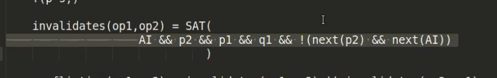

## 2020-08-28, group meeting

* lindsey: how was ICFP?
    * patrick: gan? farhad? do you want to start?
    * farhad: i enjoyed the talks, though I missed some things
* lindsey: were you able to attend PLMW?
    * lindsey: patrick evacuated and gan was displaced temporarily
    * farhad: i attended the second half
    * lindsey: i prepared for 6 months, partially because all of you are
      starting out; it's frustrating the timing of the wildfire; i hope next
      time you're able to participate
    * lindsey: also, reach out to Kenny Foner if any of the things they
      discussed apply to you; also Amal's talk and Nadia's talk about z3
* lindsey: the way i attend conferences has changed; i attend fewer talks; my
  interests are deeper an narrower
    * lindsey: i want to give you all permission to skip talks and focus on the
      social events; that said, the [Composing and Decomposing Op-Based CRDTs
      with Semidirect Products](https://dl.acm.org/doi/pdf/10.1145/3408976)
      talk, which gan suggested we read for this week, [is relevant for our
      research]
    * lindsey: the haskell symposium and the haskell implementer's workshop are
      today [and yesterday]; [couldn't keep up] and i think it's good to see
      some of those talks
        * patrick: i attended x y and z; i've posted talks i liked in the casl
          channel, and will continue
        * lindsey: are you all familiar with transactional memory? it used to
          be [couldn't keep up] .. it's been a success in haskell
* lindsey: what other highlights? gan?
    * gan: i had trouble focusing, it's almost my first conference, being a
      virtual conference it was even harder; i don't know how to socialize
      virtually
    * lindsey: we tried some socialization with breakout rooms at PLMW; it
      didn't work well because the technology failed (web users of zoom
      couldn't use breakout rooms)
    * [couldn't keep up]
    * patrick: let's "attend" the next virtual conference together;
      coordinating with eachother on slack about talks and social rooms
* lindsey: the next one is OOPSLA
    * lindsey: things might be different; i've heard organizing it has had some
      trouble
    * lindsey: i did ICFP organizing; in particular, we captioned the talks; we
      sent them to a professional captioner; we then corrected them
      line-by-line; it was a new way to experience talks; i hope it's useful
      for you
    * lindsey: correcting the captions for the first few talks in section 4
      made me interested in the topics!
    * lindsey: some people struggled with the q&a being directly after the
      talk, concurrent with the following talk; some talks didn't have speakers
      present to answer questions
    * patrick: i had trouble with the program and multi-track stuff
        * lindsey: it's usually one-track; this one didn't had that
    * [couldn't keep up]
* lindsey: despite all of our homes almost being on fire...

# 2020-08-14, group meeting

* lindsey has to stop at 12:30pm
* lindsey:
    * PLMW notifications haven't gone out; sorry
    * Everybody gets in; don't worry if you are
    * SPJ wants the panel to go well, so please feel free to ask questions
      depsite the short intro
* lindsey: how is everyone going this week?
    * farhad: i got a new housemate, and we had a barbecue at the beach, some
      confusion about what to work on
        * lindsey: because of the recent questions about the direction for
          gallifrey?
        * [farhad describes some confustion]
        * lindsey: this is a common problem; not knowing what you're supposed
          to implement
            * if there are several options, try to write down what the options
              are, try implementing one, or try implementing several
            * rubber duck: explain the issue on slack to lindsey
    * patrick: long and confusing update
        * trouble using liquidhaskell and doctest
        * milestone with gan in editor project
            * nixops procrastination vs puppet
                * lindsey/farhad: monotonic or stable properties give you
                  strong reasoning tools
                    * Arjun Guha worked on [Puppet configuration
                      verification](https://arxiv.org/abs/1509.05100)
                    * Also did some [follow up
                      "tortoise"](https://people.cs.umass.edu/~brun/pubs/pubs/Weiss17ase.pdf)
    * gan: working on formalizing operational semantics for a distributed
      system running on a weak consistency network; combining the various ideas
      from the papers we have been reading
        * gan presents document "Explicit Consistency"
        * allows the application to define an invariant
        * gan represents the operation as function which returns (State ->
          State), similar to q9 and cav19
        * gan has another interface that represents an operation as a set of
          constructors typed Eff, and there's a function `interp :: Eff ->
          State -> State`
        * lindsey: a typical setup
            * have an invariant
            * show that it's true in an initial condition
            * show that if it holds in one state it should hold after a transition

[discussion continues in the paper discussion meeting]

# 2020-08-07, group meeting

* [patrick presents the vrdt-sync app and vrdt-class]
* questions on umd/oopsla/vrdt code
    * farhad: [of the LH annotation on lawCommutativity] are we assuming
      compatible is commutative? is that ok b/c of the foralls on op1 and op2?
    * gan: do we need to specify a precondition on apply that states that the
      state is compatible with the operation? ie. something like `{-@ apply ::
      t -> {v : Operation t | compatibleState t v } -> ... @-}`
    * lindsey: can you show me the place in the code in which we are using
      compatible/compatibleState to decide whether or not to apply an
      operation, or put it on the pending queue?

# 2020-07-31, group meeting

* deniz is joining meeting
    * deniz: i'm working at google, in the databases team, on distributed
      systems, phd from cornel, previously worked on consensus
    * lindsey: deniz is our advocate at google for this project; many thanks
    * deniz: if you want, i can tell you a little about what happens behind the
      scenes
    * deniz: many applications; but use "hot crp" like a conference, committees
      based on peoples expertise; as with conference, cut down to a short list
      of submissions; award doesn't have deliverables; try to award high
      quality work that's not previously funded
    * lindsey: indeed, not yet funded by the NSF
* lindsey: intros
    * patrick: starting at UCSC now; working with gan to verify dkvs using LH,
      refinement types are predicates of values enforced at compile time, also
      worked with LH people on oopsla submission
    * gan: starting this fall at UCSC; collaborated to build dkvs; learning LH
      and reading papers about verification of consistency
    * deniz: is the idea that you build the KV store with haskell and then add
      verification?
        * lindsey: yes; often build something without running code; with LH we
          build implementation and add verification
        * lindsey: the technique used to embed LH in the language is in
          principle applicable to other languages
        * deniz: there's a project at cornell doing something similar with
          java, but less focused on verification
    * farhad: i'm working on a project with Matthew M from Cornell called
      Gallifrey (sp?) inspired by Indigo, to check if operations on shared
      state conflict with eachother [w.r.t invariants]
        * lindsey: the underlying thread is that these two projects use an stm
          solver under the hood; LH uses z3 to verify the predicates on types;
          Gallifrey uses z3 to check for violations of pre/post conditions on
          the Java operations lindsey: more on the project
    * lindsey: limitations in the solvers underlying these systems sometimes
      crop up, and so one future exploration would be to use custom solvers [to
      solve these problems more closely]
        * lindsey: during my work at intel on verification of neural networks
          the team needed to build a custom solver because the off-the-shelf
          solvers have certain limitations; building a domain-specific solver
          is a new thing
        * lindsey: the bridge between distributed systems and solvers is a new
          area that doesn't have much academic collaboration
    * lindsey: at intel i funded some projects, and the amount of interaction
      was not consistent; i'd like to leave it up to you the level which you'd
      like to be involved in the project
        * deniz: same, sometimes the other side wants more or less involvement
        * deniz: the things that i can help with: if you want to test on google
          cloud, or if you want to meet on a schedule, and i can provide you
          with feedback, or if you want to understand the things that google
          [computing at scale] care about w.r.t. tradeoffs, or if you're
          interested in internships we can talk about that and the kinds of
          projects available
        * deniz: meeting/collaboration doesn't have to be limited to the
          timeline of the award
* farhad: [sharing screen for demo]
    * farhad: classes, operations, invariants, and restrictions
    * farhad: our goal is to find conflicts between operations
    * farhad: [demo; discussion of particular invariants/formulae/relation
    * lindsey: this is supposed to be used in the context of a replicated
      system; also the generation and modification of invariants is a
      presentation from indigo but is slightly unusal
    * lindsey: a "tournament example" -- a tournament allows 5 players, and
      there are currently 4 signed up, at two separate replicas, 1 additional
      player signs up simultaneously, for a total of 6; how does the store
      resolve the two distinct signups?
    * [typist couldn't keep up]
    * deniz: why is the invariant checking done [in the peculiar way] [lindsey:
      with substitution into the invariant]?
        * lindsey: it's strange; this paper came from the systems community,
          not the verification community; it works, but it's a little hard to
          reason about; we don't have to do the same implementation?
* deniz: if you're interested in internship next summer, the time to be
  thinking about it is now, and the time to interview is sept/oct
    * [deniz signed off]
* lindsey: i've been talking with friend james wilcox about the indigo paper;
  he got nerd sniped
    * lindsey: should we discuss cops2 or indigo stuff more?
    * **a brief discussion of the paper followed** [see the paper-reading meeting doc]
* lindsey: let's talk about james wilcox research
    * there's a tool from MSR (microsoft research) called IVY for verification
      of distributed systems which <http://microsoft.github.io/ivy/>
    * james has a tool that looks like python which is similar
      <https://github.com/wilcoxjay/mypyvy>
        * it's a thin layer over smt solvers with the ability to discuss
          transitions
        * [lindsey showing the tournament example]
            * define two types, player and tournament
            * define binary relations, eg enrolled(player, tournament)
              implicitly typed as bool
            * define functions
            * define initial states as relations and functions foralls
            * define transitions [lindsey: key feature, which is also present
              in the daphne language]
                * new(..) is like the next in farhad's work
                * <-> is iff or definition
                * the | bar reads as "or" which is kind of like set union
                * the new(..) on the LHS of the iff is a marker that tells you
                  things are postconditions, and the lack of a new(..) is a
                  postcondition
                    * indigo paper infers preconditions
                    * ivy and mypyvy do not infer it, but there's guidance from
                      the automated tool
            * define invariants, which are the things you want to guarantee are
              true, and then the system will figure out if that's true
                * first it will pick an invariant
                * then it will assume all the invariants are true
                * then it will pick a transition and check if the invariant
                  remains true
        * lindsey: daphne allows you to write verification conditions that can
          be used to check conditions and then generate running code

# 2020-07-24, group meeting

* lindsey: should we buy slack? our free slack loses old messages (though, if
  we pay, we get them back) [patrick: eg. the advice about when to read papers
  or what classes to sign up for..?]
    * patrick: [slack is not organizational memory](https://abe-winter.github.io/plea%27s/help/2018/02/11/slack.html); i like the artificial
      pressure we have now to intentionally document things we care about; we
      could also make a bot to put our messages in a repo
    * lindsey: how should we do this?
    * patrick: patrick what about pinning messages? i don't know of the limits
    * lindsey: there's also zulip; we could export the slack history to zulip
    * lindsey: concerned about fragmentation
    * farhad: i don't mind switching, i'm trying to think of suggestions
    * lindsey: we could even use a slackbot command to trigger archiving things
        * farhad: i like that idea
        * patrick: auth might be hard
    * farhad: if we go [with a bot to archive messages], i have a
      suggestion/question.. how would we structure things in the repo so there
      can be tags?
        * patrick: if we build it, we can decide
* lindsey: talk about PLMW; let's apply!
    * lindsey: we're unsure about how many people to let in, because the
      constraints are different from previous years
    * lindsey: we're usually constrained by venue, and by cost (PLMW covers
      the cost of attending the conference for some attendees)
    * lindsey: in the recent PLMW at PLDI, it was the biggest ever, with many
      participants watching the live stream
    * farhad: when is the deadline to apply?
    * lindsey: august 8
* lindsey: let's talk about Farhad's project
    * lindsey: you're all familiar with Matthew's project, Gallifrey (sp?)
      where they have a language where you can put annotations on operations on
      data; eg. you can put preconditions and postconditions on operations
      (specifies what must be true beforehand, REQUIRES, and what will be true
      afterward, ENSURES)
    * lindsey: this is similar to the sort of thing that was done in the indigo
      paper [V Balegas, S Duarte, C Ferreira, R Rodrigues, Putting consistency
      back into eventual consistency (EuroSys
      2015)](https://hal.inria.fr/hal-01248191/document)
        * [typist couldn't keep up]
        * indigo statically analyzes an application to tell you when operations
          are in conflict with eachother, so that you know which need some kind
          of synchronization (such as addition of pre and post coditions) and
          which do not
        * the paper is hard to understand; it is not a PL paper, it is a
          systems paper; they don't write down a semantics of how the
          annotations are evaluated; they don't write down a syntax
        * there's a notion of an effect, and there's clearly state being
          manipulated; the state is implicit
    * lindsey: farhad's project is similar, in that it's a smaller version of
      something like indigo; putting annotations on operations and writing down
      invariants; making calls to a solver to analyze operations and find out
      which are in conflict
    * **farhad sharing screen** 
        * lindsey: prelude; there's an open source implementation of indigo,
          which matthew tried to understand; the implementation is large,
          complex, and not well documented; eventually we determined to
          implement our own thing; that's what farhad is doing; it's in java;
          it interacts with z3; the hope is that we can implement a
          stripped-down version of indigo which can be integrated into
          gallifrey (sp?); another goal would be to have a more formalized
          explication of what this is and how it works for a PL audience
        * farhad: the main thing i've learned in this project is about how to
          excplicitly reason about the implicit stuff [lindsey: yes, the indigo
          paper leaves even more unsaid than i thought]
        * patrick: are we in contact with the authors of the indigo paper?
        * lindsey: not yet; we haven't reached out; i know some of the authors,
          but the paper is 5 years old now
            * lindsey: it is often hard to replicate somebody else's work
        * farhad: here's an example of a class with some operations, we want to
          check that when these operations used concurrently, don't conflict
            * farhad: there's a gallifrey (sp?) annotation that specifies pairs
              of operations to check for conflicting behavior
            * farhad: the way we reason about whether conflicts can happen is,
              given a state, when an operation is called [typist could not keep
              up]
        * gan: is there any verification that the code matches the spec?
            * lindsey: no, this assumes the specs describe the code correctly
            * patrick: is the a need here for a toy language which generates
              both the code and the annotations to ensure that they correspond?
            * lindsey: in the [hyperkernel
              paper](https://unsat.cs.washington.edu/papers/nelson-hyperkernel.pdf),
              they have an intermediate specification
                * lindsey: **sharing figure 2 of the paper**, they have to show
                  that each layer (declarative spec, state-machine spec,
                  implementation) correspond
                * lindsey: by splitting things out, it was easier to facter out
                  things that could be automated from things that could not; if
                  we ever get to the point of verifying that these annotations
                  are the right annotations for the code, this is an approach
                  we might consider
        * farhad: so during the run, it checks if the operations conflict if
          run concurrently
            * farhad: so in this example, it's showing that the `withdraw`
              operation conflicts with itself
            * farhad: the way that we try to do this is, there are app
              invariants (the overall invariants we define above the class),
              and we generate a sat problem on a relationship between the
              invariants 
            * lindsey: [typist couldn't keep up]; we need to figure out what
              these `next(..)` semantics are; there's no notion of
              sequencing/order in these operations; my suspicion is that
              instead of trying to cram everything into the solver, where
              implicitly things are running at different [times]; my suspicion
              is that we'll need to make an analysis that threads through state
              and calls into the solver as necessary
            * lindsey: this is also something that seems left out of the indigo
              paper; it's not a surprise to me that in attempting to implement
              the indigo paper, we go have stumbled on this problem
            * gan: as lindsey mentioned, the meaning of this next is a little
              ambiguous, and i noticed in the editor, it's applied to a
              variable in one place, and a formula in another place
            * lindsey: we need to write down the semantics of our analysis are,
              and figure out where in the analysis we need to call the solver
            * farhad: [the `next` only "changes" values in context, because the
              [evaluation?] is call-by-value] ??
* lindsey: ok, let's talk about the COPS paper for the next 30m..

# 2020-07-17, group meeting

* some paper discussion
    * lindsey: the chapar paper has two implementations of KV stores
        * impl 1 is their version of Casual Memory
          <https://smartech.gatech.edu/bitstream/handle/1853/6781/GIT-CC-93-55.pdf>
        * impl 2 is their version of this:
          <http://www.istc-cc.cmu.edu/publications/papers/2013/eiger-nsdi13.pdf>
            * maybe we should read this paper next week intsead of the "cops"
              paper?
    * lindsey: the cops paper claims to be "causal+ consistency" which is
      supposed to be better
        * the cops paper came out in 2011, which is when the crdts papers were
          just coming out
    * lindsey: also gan pointed out that the AOS (abstract operational
      semantics) looks just like implementation 2
        * patrick: i thought all of them were very specific, so as to leave
          little room in the problem domain
        * gan: the AOS is already an implementation, it's concrete and you can
          run it
    * lindsey: patrick, the first COS is "no holds bars"
        * there are no clocks
        * the messages can be delivered, or not, and in arbitrary order
        * figure 6 COS: rules out nothing, and imposes no constraints
            * it's required to provide an implementation to see what this means
        * figure 7 AOS: adds clocks and bakes the kv store into the semantics
            * this is runnable
        * figure 9 CIOS: adds the clocks to the COS [typist couldn't keep up]
            * patrick: used to define well-rec
    * lindsey: they argue that showing well-rec is easier than showing that
      "all of the executions that can occur is a subset of the definition all
      allowed execution"
* oopsla UMD paper
    * lindsey: we got all Bs, weak accept (scores are A-D); we wrote a good
      rebuttle to that
    * lindsey: the paper is about proving that CRDTs converge using liquid
      haskell, but we didn't address anything beyond those CRDTs themselves
    * lindsey: there's a whole lot of other work, that looks at the higher
      level properties of a particular program that uses CRDTs
    * lindsey: chapar could be said to be about the higher level properties,
      because they discuss these assertion failures in client programs and
      implementations
    * lindsey: we haven't done anything like that, and the reviewers asked us
      about whether we could
    * lindsey: the nice thing about liquid haskell is that we could go ahead
      and do that in the existing code potentially
    * lindsey: discussed this a bit with farhad, who is showing that
      postconditions are true given a sequence of operations [typist couldn't
      keep up]
    * lindsey: we should all become more familiar with liquid haskell
    * farhad: hi! good morning
* patrick: farhad, use stack even though i don't
    * gan: stack team here!
    * patrick: grumbling about fpcomplete and stack
    * lindsey: formality slider! http://www.cs.cornell.edu/~ross/
    * lindsey: cabal is the older/lower-level thing, and stack is bulit on top
      and is easier to use
    * lindsey: [story about old coworker who's only sticking point was nix
      being better than other things]
[continued in paper-reading meeting]

# 2020-07-10, group meeting

* linsey: let's talk about gan+patrick's pair programming project
    * gan: we're trying to figure out how to implement an editor
    * patrick: churning between 2d representation of editor content and 1d
      representation of editor content
    * lindsey: i had roommates/friends who wanted to implement a collaborative
      editor, and learn haskell.. they were implementing in a modular way, with
      a plugin system, where plugins could change the behavior of keystrokes..
    * patrick: we're going for a minimal approach for exploring collaborative
      editing
    * gan: for this week, i implemented RGA, and now i understand it better..
      in gomes-et-al they said that the unique ids must [correspond to
      causality].. in short, this guarantees that concurrent inserts are
      commutative..
    * patrick: can you use a uuid and sort by that and still satisfy this
      requirement?
    * [more discussion, typist couldn't keep up]
    * gan: here's a link to the RGA impl
      <https://github.com/lsd-ucsc/editor/blob/interpret/src/CRDT/RGA.hs>
* lindsey: did you look at the original paper, or in gomes-et-al?
    * gan: gomes-et-al
    * lindsey: the thing about "RGA requires the IDs to reflect the total order
      of causality" was news to me when reading the gomes-et-al paper [typist
      couldn't keep up]
    * lindsey: there's a similar thing in the amazon dynamodb paper, which they
      don't make explicit, but they do use vector clocks to determine order of
      events, to reduce the number of causal anomalies
    * lindsey: the RGA requirement is similar
* lindsey: in undergrad dist sys class, we discuss different kinds of logical
  clocks relationships and being "consistent with causality"
    * lamport clocks give you one direction but not the other [typist could not
      keep up]
* lindsey: hi farhad!
    * farhad: this similar to last week's paper, but you can define the
      consistency model
    * lindsey: this paper is more general, because it allows examining a
      variety of consistency models
    * lindsey: the other major difference, is the automated aspect of this
      paper, it can be done with z3
    * lindsey: whereas with the gomes paper, more is done by hand,
      mechanised-proof-assistant, rather than a theorem prover; but also the
      set of assumptions in the gomes paper is very small, you start with a
      small set of axioms
* lindsey: with the cav19 paper, there's a lot of math that's done outside
  of the theorem prover to establish ...
* lindsey: [typist couldn't keep up] the whole idea was checking
  "noninterference to commutativity" (NTC) against a given consistency property..
  this part is automated
* lindsey: is it actually the case that NTC implies SEC? that's what they
  proved on paper, and that's their primary contribution
    * lindsey: the gomes paper [throws shade on] these efforts that use
      proofs outside of ITP or ATP tools
    * lindsey: there may be bugs in the NTC->SEC proofs
    * lindsey: there's a paper about this issue, called [run your
      research](https://users.cs.northwestern.edu/~robby/lightweight-metatheory/popl2012-kcdeffmrtf.pdf),
      [POPL2012 talk about run your
      research](https://youtube.com/watch?v=BuCRToctmw0)
    * lindsey: PLT redex will let you write down your language
      specification and get an implementation; "lightweight mechanization"
      lets you find bugs in your math easily (lightweight because you're
      not proving anything)
    * lindsey: this cav19 paper, i don't know if redex would have been an
      appropriate tool, but this paper is almost not PL; it's like a big
      transition system
    * gan,farhad,patrick,lindsey: there aren't enough examples of the
      transition system, they change from their signature in the
      "illustrated examples" section to another
* lindsey: there's different ways to view this paper
    * lindsey: we could take you at your word that theorem 1 is true, treat it
      as a black box, and then build on top of it
    * lindsey: another way to use this paper, would be to try to understand
      their proof technique, by digging in more deeply
    * lindsey: another thing to keep in mind is that the CAV audience,
      which is distinct from a PL or a dist-sys audience
    * lindsey: eg. contrast with the original CRDT paper, which discusses
      replicas; it's very common to discuss replicas in a dist-sys conference;
      if you're going to talk about replicas, you need to have a fixed number
      or have some affordance for replicas to leave and join
    * lindsey: none of that is part of [the cav19] formalism; they don't have
      any of that, they have a big transition system with a "soup" of things
      that are happening .. and use some [paraphrased: weedle words/phrases] to
      relate it back to [the concrete]
    * patrick: is that a weakness? i didn't notice because i don't know what's
      standard
    * lindsey: not a weakness, it's a choice.. it's our job as researchers to
      be aware of these choices; be aware that they made the choice not to talk
      about replicas

# 2020-07-03, group meeting

* lindsey: proof left undone in the UMD LH paper is for the causal tree
    * lindsey: the gomes paper RGA proof might have insights
    * gan: about the UMD project, what network is defined?
    * lindsey: the UMD paper doesn't have any network axioms
    * lindsey: as you saw from this paper, those assumptions are necessary for
      some CRDTs but not others; eg. for the counter, causal delivery is
      unnnecssary
    * lindsey: next paper will include this discussion
    * lindsey: [typist couldn't keep up]
* lindsey: overall point, it's interesting that the RGA CRDT in the gomes paper
  is the one that is most difficult to prove convergence of because it works on
  sequences.. sequences make everything hard.. why? if you're inserting
  something into a list, and you're concurrently inserting something else, the
  indices change.. or if you insert and delete, these operations don't commute
  in general.. and the reason why this matters: they have this requirement that
  if you delete an element, the element must exist.. what if you're deleting an
  element and concurrently somebody else is concurrently inserting?
    * lindsey: maybe we need to look carefully at what they did, in the
      accompanying artifact
    * patrick: i felt that i couldn't keep track of all the details in the
      paper (much less the artifact) because i don't really know isabelle
    * lindsey: [typist couldn't keep up]
    * lindsey: it is important to understand what they gain from the automation
* lindsey: i don't think there's a clear cut distinction between automated and
  manual proving tools
    * lindsey: what is it that the human has to do, and what is it that the SMT
      is doing for you
    * patrick: i think we need to learn multiple tools to answer those
      questions
    * lindsey: there's a paper, "A Tale of Two Provers" that compares liquid
      haskell and COQ; it's a few years old now; when i first read it, i didn't
      get as much as i thought I would out of it
    * lindsey: i think it's worthwhile to sample these tools and get a sense
      about them; i haven't seen a broad survey comparison of what they all do
    * patrick: maybe finding examples to translate as a group
    * [typist couldn't keep up]
    * lindsey: they all use both proof and code
        * gan: coq has code
        * lindsey: isabbelle, everything that starts with fun is code
        * lindsey: LH is special because it's an practial language with the
          proofs added on
* lindsey: the LH group originally described using the LH technique to "turn
  any language into a theorem prover" in a paper that didn't get published:
  <https://arxiv.org/abs/1610.04641>
    * patrick: go is simple and could be a testbed for this
    * lindsey: at virtual PLDI i spoke with a person using COQ to prove things
      about go programs: <https://www.chajed.io/papers/goose:coqpl2020.pdf>
    * lindsey: he said "how do we convince systems people of the importance of
      tools like COQ"?
    * lindsey: [i'm coming at it from the opposite perspective]
    * lindsey: this is a short paper, their tool is called "goose" which is a
      fun pun
    * lindsey: can you really do LH approach with any language?
    * gan: maybe because haskell is a functional language it's easier?
    * lindsey: is there any way between these two approaches [typist couldn't
      keep up] to do this with another language?
* lindsey: i got an email from somebody recently who was asking for critique of
  [a systems teaching approach very distinct from lindsey's which is
  concepts-first]
    * lindsey: [typist couldn't keep up; discussion of how to start learning
      distributed systems]

# 2020-06-26, group meeting

* lindsey: dkvs repo future is unknown
    * gan,patrick: let's try developing on forks to move quickly and explore
* lindsey: liquid-haskell is now a ghc-compiler plugin (as of 8.10.1)
    * gan has already started digging into the new liquid-haskell ghc-compiler
      plugin
      [tutorial](https://github.com/ucsd-progsys/liquidhaskell/blob/develop/src/Language/Haskell/Liquid/GHC/Plugin/Tutorial.hs)
        * gan: the hackage liquid-haskell is out of date
        * gan: to play with the plugin, you need to clone the git repo
    * gan is looking to try development of liquid-haskell
        * lindsey: look at the code, look at the mailing list, etc.. unsure
        * lindsey: potentially look at the typeclasses for liquid-haskell paper
* lindsey: re discussion about lifting
    * lindsey: i incorrectly used the work reflection, the right phrasing is
      "lifting haskell functions into refinement types"
    * lindsey: classic example is referring to the length of a list (using the
      haskell function length) in the type
    * lindsey: two ways to do this in liquid-haskell, measure and reflect
        * the measure annotation lets you refer to some code in a type, but
          code isn't analyzed; unsure
        * the reflect annotation actually does some evaluation of code at
          typechecking time
    * lindsey: there's a popl18 paper that discusses reflect, but nikki's
      dissertation might be better
    * lindsey: it's also worthwhile to look at kaplan (caplan?) which is
      kaplan:scala::liquidhaskell:haskell
        * kaplan gives up on decidability
        * liquid-haskell goes to greath lengths to keep things decideable
        * there are circumstances where you're ok with undecidability
    * farhad: looked at the refinement-reflection paper and am looking at
      (inaudible) kaplan paper (inaudible)
        * lindsey: figuring out how to handle the lifting for gallifrey is
          going to be a long term project
        * lindsey/farhad: googling for this will get you Dr. Who references
        * lindsey: the link is https://www.cs.cornell.edu/~milano/project/gallifrey/

# 2020-06-22, group meeting

* let's read the 'gomez et al' 'verifying sec' paper this week
    * notable because they modeled the network in addition to their data
      structures
        * including the fact that messages can be slow, or lost
        * network conditions aren't parameterized, but are part of the proof
* we should be signing up for fall courses
